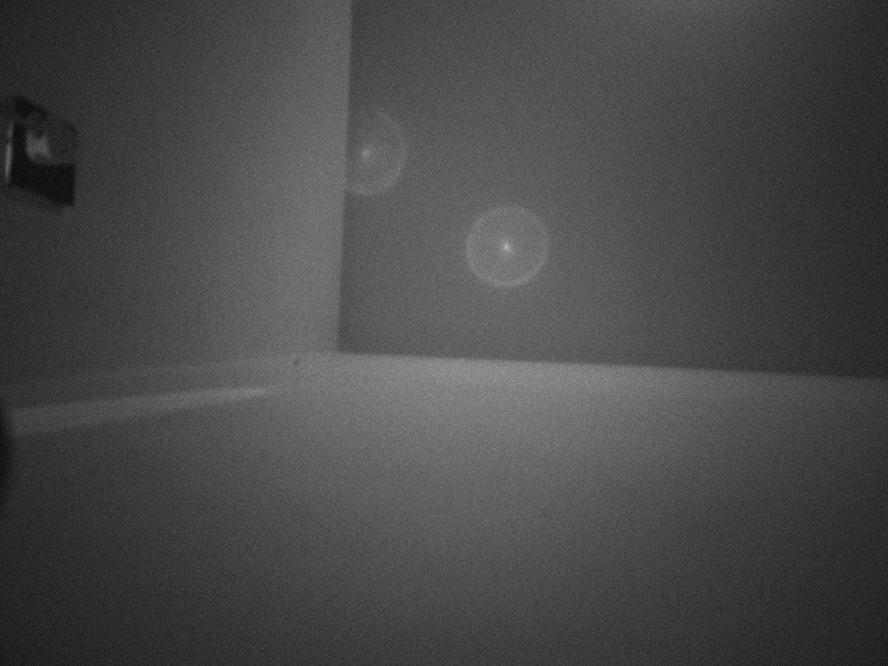

# op9_camera_model

Raw camera access on the **OnePlus 9 (LE2110, SM8350 / Snapdragon 888)** for
running the **openpilot v0.11 driving model** with **no Android frontend** —
reading frames straight from the Qualcomm **Spectra ISP** via the
`cam_req_mgr` kernel interface, the same way openpilot's `camerad` does on comma
hardware.

Goal: open the two road cameras (wide + narrow), get raw/NV12 frames directly
from the ISP, feed them to the v0.11 supercombo model, and measure inference
speed — all inside the Termux **proot Linux** environment, bypassing
`ai.flow.android` / Camera2 entirely.

## Status / honesty

This repo is in **stages**. What runs today vs. what still needs the
SoC-specific reverse-engineering is clearly marked.

### ✅ First frame captured (IMX689 → camerad → PNG)

A real IMX689 frame was captured straight through the **Spectra ISP via `camerad`** (no Camera2)
and dumped to PNG — the full `cam_req_mgr` acquire→link→start→stream→**buf_done** pipeline works.



The working code is the camerad port (`cameras/spectra.cc`, `cameras/hw.h`, `sensors/imx689.cc`)
plus the device-kernel diffs in `patches/camera-kernel-sm8350.patch`. The full recipe (the
`hw.h` PHY-macro bug, RDI + `RDI_SOF_EN`, forcing a full IFE via `can_use_lite=false`, and the
decisive **frame-based WM** `wm_mode=1`) is written up in `docs/STREAMING-BRINGUP.md`.

| Piece | State |
|---|---|
| `cameras/spectra.cc` — camerad RDI capture (acquire→link→start→**buf_done**→raw dump) | **WORKS** — frame captured |
| `src/cam_probe.c` — open `cam_req_mgr`/`cam_sync`/ISP, `CAM_QUERY_CAP`, get IOMMU handles | **WORKS** (validated on device) |
| `src/spectra_capture.c` — full acquire→link→start→stream sequence | **scaffold**: correct ioctl flow, OnePlus-9 sensor/IFE magic = `TODO` |
| `src/sensors/imx766.h`, `imx689.h` — sensor init/start register arrays, power seq | **TODO** (extract from LineageOS kernel, see `docs/SENSOR-EXTRACTION.md`) |
| `model/bench.py` — load v0.11 supercombo, 2-cam tensors, measure inference Hz | **WORKS** (synthetic frames; real frames wire in once capture streams) |

The hard, device-specific deliverables (documented, not guessed):
1. **IMX689 + IMX766 sensor data**: probe IDs, I2C init/start register arrays,
   power sequence, MCLK, MIPI settle/datarate. Source: the OnePlus 9 LineageOS
   kernel `techpack/camera` sensor drivers / Sony datasheets.
2. **SM8350 IFE register offsets** (only if you want hardware NV12 instead of
   RAW Bayer). The easy path uses the **RDI/RAW** ISP output and skips these.
3. **SM8350 `media/cam_*.h` UAPI headers** — must match the OnePlus 9
   camera-kernel, not comma's SDM845 copies.

## Why (the motivation)

The Android-app camera path on this phone forces the **ultra-wide IMX766** lens
through Camera2 with digital-zoom warping, which gives the model a distorted
~99° FOV it wasn't trained for → poor depth/lead estimation. Direct ISP access
lets us:
- pick the right sensor/lens (IMX689 main wide) and feed a clean, undistorted
  frame at the correct intrinsics,
- get low-latency raw/NV12 directly (no Camera2 → JPEG/warp pipeline),
- run a true **two-camera** (wide + narrow) v0.11 model.

## Hardware (probed)

- SoC: Qualcomm SM8350, Spectra (Titan) ISP, kernel `5.4.268-qgki`
- Camera kernel nodes: `/dev/video0`=`cam-req-mgr`, `/dev/video1`=`cam_sync`,
  `cam-isp`, `cam-icp`, 6× `cam-csiphy-driver`, 4× `cam-sensor-driver`
- Sensors (by `sensor_id`): **0x766 IMX766** (50MP), **0x689 IMX689** (48MP),
  0x471, 0x2 (mono). IMX766 seen streaming on **CSIPHY_IDX 2**, I2C `0x34`,
  datarate `5.7929 Gbps`, settle `2.8 µs`.

## The blocker, and how we get around it

`/dev/video0` is normally held by the Android camera HAL
(`android.hardware.camera.provider@2.4-service`, → `open()` = `EALREADY`).
**Confirmed**: `setprop ctl.stop vendor.camera-provider-2-4` releases it, and the
proot (as root) can then open `cam_req_mgr` directly. Restart with
`ctl.start vendor.camera-provider-2-4`. See `scripts/hal.sh`.

## Build / run

```bash
# in the proot (sudo login-flowpilot-root), from this dir
make probe                      # builds + runs the validated cam_req_mgr probe
./scripts/hal.sh stop           # release the camera from Android HAL
sudo ./build/cam_probe          # open nodes, query cap, print IOMMU handles
./scripts/hal.sh start          # give the camera back to Android

# model inference benchmark (works now, synthetic frames)
python3 model/bench.py --model /path/to/supercombo.onnx --runs 200
```

## Layout

```
src/cam_probe.c        validated: open nodes + CAM_QUERY_CAP + IOMMU handles
src/spectra_capture.c  full Spectra acquire/stream scaffold (TODOs marked)
src/cam_uapi.h         minimal cam_req_mgr/cam_defs structs+opcodes (port to SM8350)
src/sensors/           imx766.h, imx689.h  (register arrays = TODO)
sensors/imx766.cc      IMX766 (ultrawide/road) SensorInfo: C-PHY, 2.4576 Gbps, init groups
sensors/imx766_registers.h  IMX766 4000x3000 binned register table (full, captured)
sensors/imx689.cc      IMX689 (main wide) SensorInfo -- 2-camera support; CSIPHY 1
sensors/imx689_registers.h  IMX689 register table (reset stub -- TODO: HAL capture)
patches/camerad-v0.11.1-sm8350.patch  the full openpilot v0.11.1 -> OnePlus 9 port
model/bench.py         v0.11 supercombo two-camera inference-speed benchmark
model/frames.py        NV12/YUV420 frame formatting for the model input
scripts/hal.sh         stop/start the Android camera HAL
docs/SENSOR-EXTRACTION.md   how to pull IMX689/IMX766 data from LineageOS source
docs/SPECTRA-SEQUENCE.md    the exact ioctl sequence (from openpilot camerad)
docs/STREAMING-BRINGUP.md   IMX766 streaming: the C-PHY/datarate fix that got MIPI flowing
```

## camerad port status (openpilot v0.11.1 on OnePlus 9)

Apply `patches/camerad-v0.11.1-sm8350.patch` to a clean openpilot v0.11.1, then
overlay the full `sensors/imx766_registers.h` for real streaming registers.

| stage | status |
|---|---|
| compile + link, runtime, IOMMU/session | done |
| IMX766 + IMX689 probe + acquire (2 rear cams) | done |
| ION buffers, IFE acquire + config, CSIPHY start | done |
| **IMX766 emits MIPI (C-PHY + 2.4576 Gbps fix)** | **done -- `irq_status_rx=0x400077`** |
| **CCIF frame-timing (coherent 4096x3072 mode)** | **done -- violation gone** |
| sensor SOF / frames | needs QSC(3072) shading table |

Two big unlocks (see `docs/STREAMING-BRINGUP.md`):
1. The IMX766 is **C-PHY** (3 trios), not D-PHY, at **2.4576 Gbps** (1.9255 was
   IMX689's) -- that got MIPI flowing.
2. The HAL streams a **4096x3072** mode (`BASE_INIT 522 + QSC 3072 + RES 144`), not
   the old 4000x3000 capture -- switching to it (`sensors/imx766_registers.h`,
   BASE_INIT 522 + RES 144 extracted via kprobe) cleared the CCIF frame-timing error.

Remaining: the **QSC(3072)** shading table is required for this quad-bayer binned mode
to emit SOF; it can't be pulled via the offset-fetch kprobe (high offsets ramdump the
device) -- needs the sensor-module `.bin` parsed or a safe kernel dumper.

## Credits / references

The ioctl sequence is reverse-engineered from **commaai/openpilot**'s
`system/camerad` (`spectra.cc`, `camera_qcom2.cc`, `sensors/*`). This is a clean
reimplementation for the OnePlus 9 sensors; no comma code is copied.
